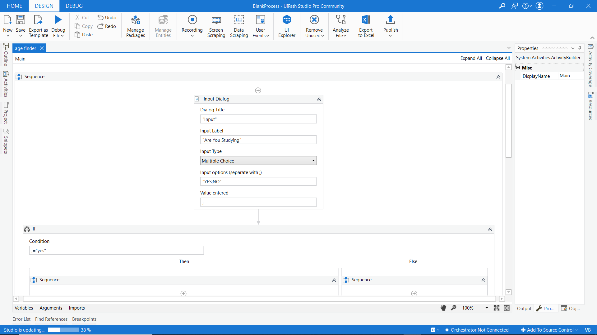
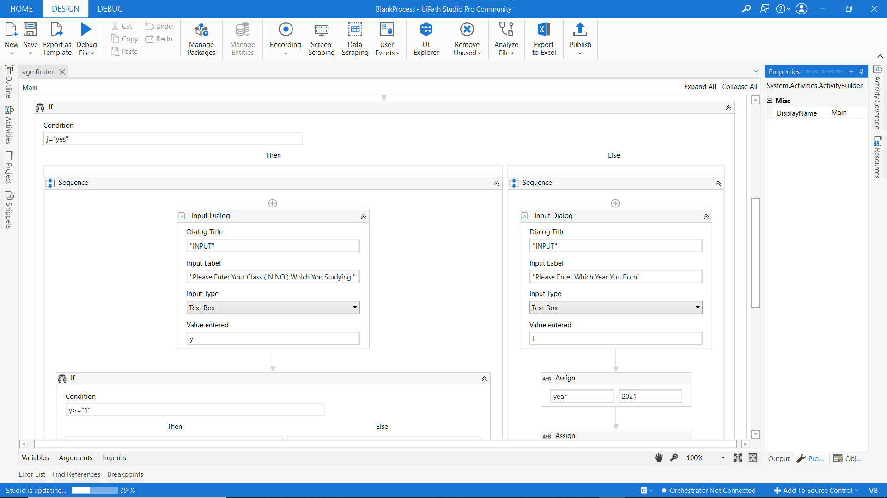
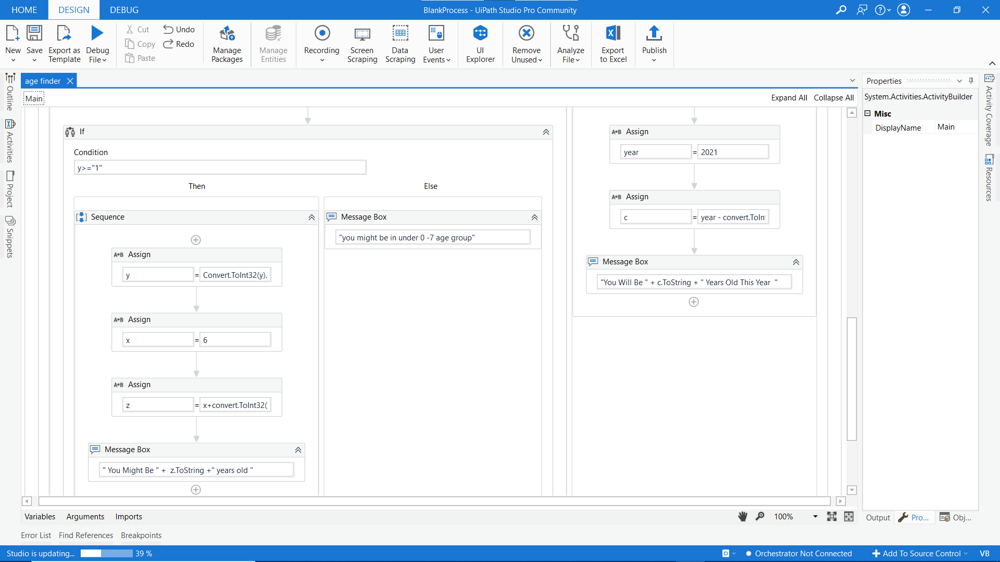
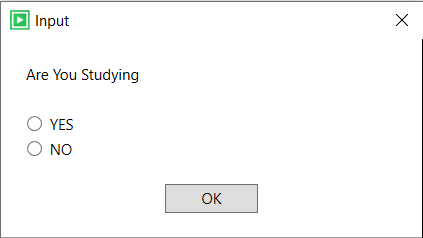
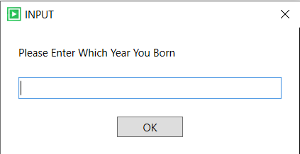
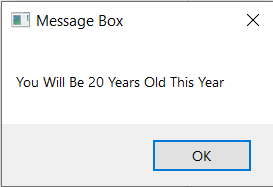

# AFacto-Age-Finder-Bot

These is a Age Finder Bot which can help people of different ages to find their age within few seconds accuratly with privacy protection of your personal data.

•Main.xaml will be able to find age by normal find age process,

•Age finder.xaml will see different layout which can be use for finding age on the basis of their class they studying/ed,

******************************************************
******************************************************
•In these automation I used - 

•**input dialog**,

•**assisgn**,

•**message box**,

•**if-else condition**.

******************************************************
******************************************************

• "**Initialisation**"

• "**Middle condition**"

• "**Output**"

******************************************************
******************************************************

•**Output Process**

•Input Prompt

•Enter Details Prompt

•Message Print Prompt

•You need to open .xaml in uipath studio to run and make changes.

*For better understanding you can watch my age finder videos on my LinkedIn profile -https://www.linkedin.com/in/rajiljain
